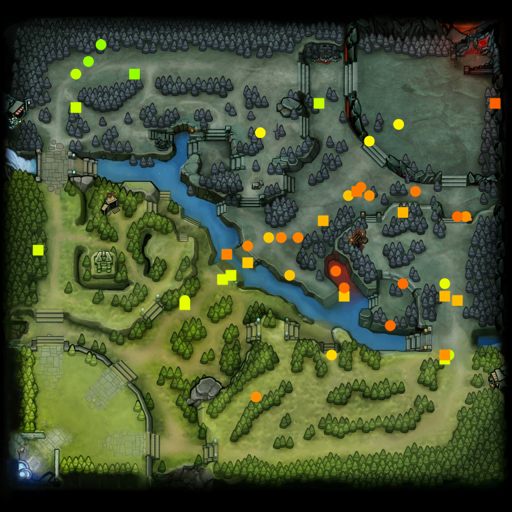

edith
=====
edith@exclusivelyducks.com
http://github.com/dschleck/edith

A Dota 2 replay (.dem) parser that understands packet entities. Tested on OS X.

Quick start:
------------
    cd build
    ccmake ../src
    make
    ./edith <a replay>

If make can't generate the protocol buffers then you may need to find the directory
containing google/protobuf/descriptor.proto and do:

    cmake -DPROTOBUF_IMPORT_DIRS=/usr/local/include ../src

replacing /usr/local/include.

Your C++ is terrible:
--------------------
I am very bad at C++ and stopped caring the moment this worked, sorry. What I'm hoping
will happen is someone intelligent will use this as a reference to write this the right
way.

Overview:
---------
Parsing packet entities requires several components of knowledge, luckily each replay
contains everything that you need.

The first thing to understand are the send properties (send props). These effectively
describe a variable in a class. As a simple imprecise example, if I had some class
like the following that I wanted to synchronize:

    class Ent {
      float x;
      int y;
    };

Then there would be a send prop named *x* with type 1 (float) and a send prop named *y*
with type 0 (int) in a send table named *Ent*.

Beyond simply adding additional types (strings, int64s, arrays) send props can also
point at other send tables whose props you want to include in this send table. The
primary use of this is for inheritance, most send tables have a send prop named
"baseclass" that points at the send table of the parent class.

The other big source of complexity comes from exclude props. If I had some class that
inherited from *Ent* but I don't care about *Ent.y* and don't want it to be
synchronized I can use an exclude prop. The name of this prop would be *y* and it
would also have a field called datatable name set to *Ent*.

After we read in all of the send tables and send props from the replay we have to flatten
them. This means that instead of having a send prop in our send table that points at the
*DT_DOTA_Unit_Hero_Windrunner* send table, we just copy all of the props in the
*DT_DOTA_Unit_Hero_Windrunner* send table into ours.

Now that we have our flattened send tables we need to tackle the *instancebaseline*
string table. Suppose you have a class with two hundred integers and every instance
sets those to zero. Rather than transferring two hundred zeroes every time you need to
create a new instance of this class, it would be better to have a default instance of
the class and then transfer only what is not in the default when you create a new
instance. The *instancebaseline* table has an entry for every class with such a default.

Finally we can parse our packet entities. When the server thinks an entity enters the
client's potentially visible set (PVS) it tells the client to make a new entity. Making
a new entity requires first parsing the entry in *instancebaseline* and then parsing
the data sent in the packet. Parsing both of these is exactly the same, first you read
the list of properties that they contain and then you read each property.

When an entity is updated you do exactly the same procedure but don't bother with
*instancebaseline*. For deleting entities you only need to read entity ID.

Understanding my code:
----------------------
*death_recording_visitor* is an example of doing something useful with my code. This
outputs a line whenever an entity is updated and is also dead (which is way more times
than actual deaths).

*entity* describes an entity and stores its properties.

*property* handles the different types of send props and stores the correct data for
each one.

*state* contains a bunch of data structures read from the replay and handles flattening
send tables.

*main* reads the replay, converts it into the internal representation used by the program,
and runs the logic for everything but flattening send tables.

Limitations:
------------
I doubt this actually compiles on anything but OS X.

This seems to work on the replays that I have tried, however there are probably a
million different bugs hiding. I'm particularily scared of a lot of the float
deserializations.

I implemented just enough logic that all the replays I have parse successfully. In
particular I didn't fully implement:

* There's a million variations of float serialization. I only implemented the ones
required for the send props in my replays.
* There's several complex string table parsing paths and some flags I don't understand.
I only implemented the path required by the instancebaseline table, and I don't parse
any other tables.

If you have a replay that works in the client but doesn't parse correctly, let me know!
